#PersonalInfo

##此页面的信息已经有较长时间未更新

##个人简介
**Mark Yueng 杨凡， Android 开发工程师** 。

广州大学计算机学院软件工程专业 2011 级本科应届毕业生，现任 **`学壹传媒` Android 开发工程师兼 Web 开发工程师**。广州大学 Android 开发俱乐部的创始人，校创新班的负责人。

初中时期就开始接触 Visual Basic 语言，痴迷系统安全领域，当时做过很多 nt kernel、hook 的研究，建过 VB6 的技术 BBS。大学后开始正式学习 C++ 语言，做了两年游戏开发（PC端），获得学院多个奖项。后来加入学校创新班，开始学习 Java & Android 应用开发 ，并于大三开始周转各种创业团队以及公司，担任多个团队中 Android 开发工程师、团队技术骨干的角色。

- Github：https://github.com/nekocode  
- Zhihu：http://www.zhihu.com/people/nekocode
- CSDN：http://blog.csdn.net/nekocode  
- Email：syfyw@qq.com  nekocode.cn@gmail.com
- Wechat：  

##能力
####语言能力
- **主要技术栈语言**  

- **其他语言**  

####其他领域
- 系统安全
- 平面设计
- 产品

##个人项目经验（? ~ 2014 年）

以下是我截至 2014 为止开发过的一些项目（都是独立开发）。 **2014 年以后的一些可公开项目请参考本 [Github 账号的主页](https://github.com/nekocode)。**

###Game
- **FScript AVG Game Engine** `c++` `DirectX` `script parser` `lua`  
http://blog.csdn.net/nekocode/article/details/7966376  
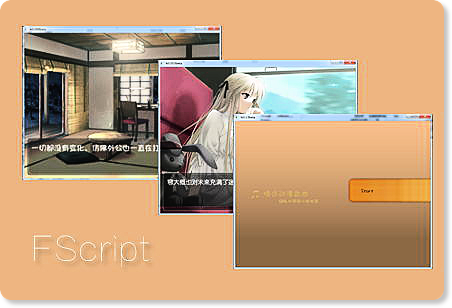  

- **Battle Beat** `c++` `DirectX`  
http://blog.csdn.net/nekocode/article/details/8935876  
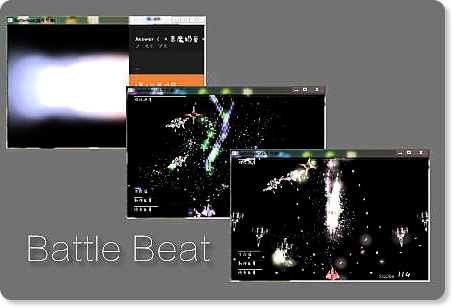  

###Android
- **CloudShare** `libvlc`  
http://blog.csdn.net/nekocode/article/details/8625678  
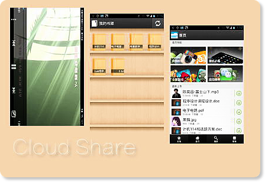  

- **FXiami** `虾米音乐` `media player`  
http://blog.csdn.net/nekocode/article/details/8718501  
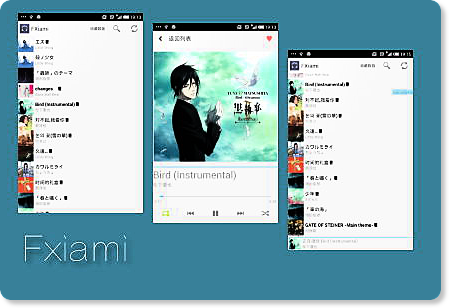  

- **大学城随身购**  
http://blog.csdn.net/nekocode/article/details/16923543  
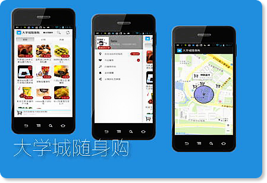  

- **学道**  
http://blog.csdn.net/nekocode/article/details/24520593  
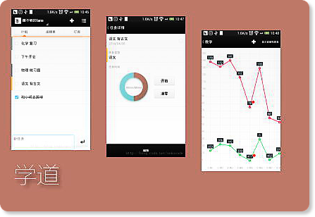  

- **Neinei** `匿名社交`  
http://www.anzhi.com/soft_1647390.html  
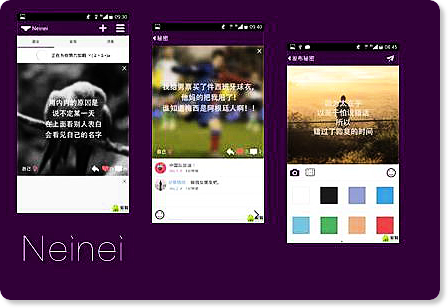  

- **Witech** `VOIP`  
http://www.anzhi.com/soft_2082389.html  
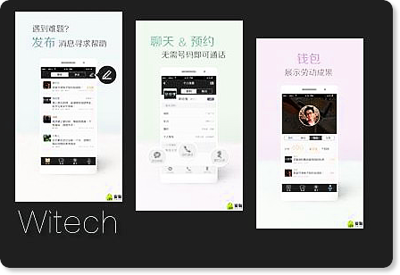  

- **MovieTogether**  
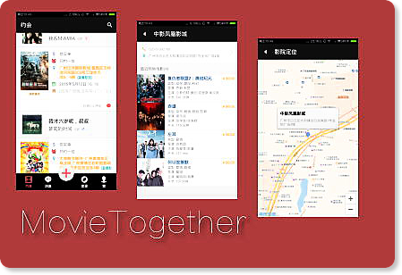  

- **Fastfood Client App**  
  

- **Seedori魔镜**  
  

- **全民工具** `X5 Engine` `leancloud`  
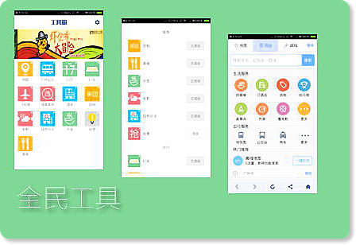  

- **Murmur** `shader` `leancloud`  
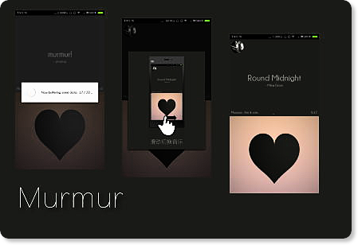  

- ***DoctorTang***（弃）  
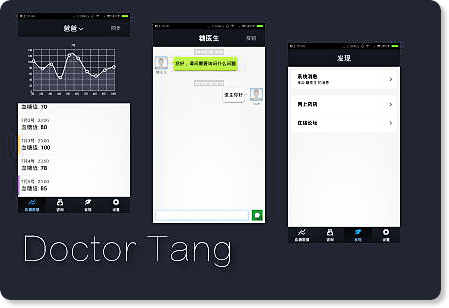  

- ***广大图书查询*** （弃）  
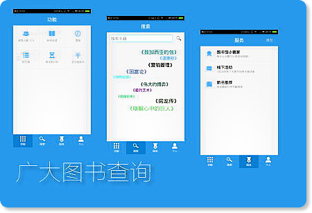  

- ***WuhuiMail*** （弃）  

###Other
Check about my **[repositories list](https://github.com/nekocode?tab=repositories)**.
